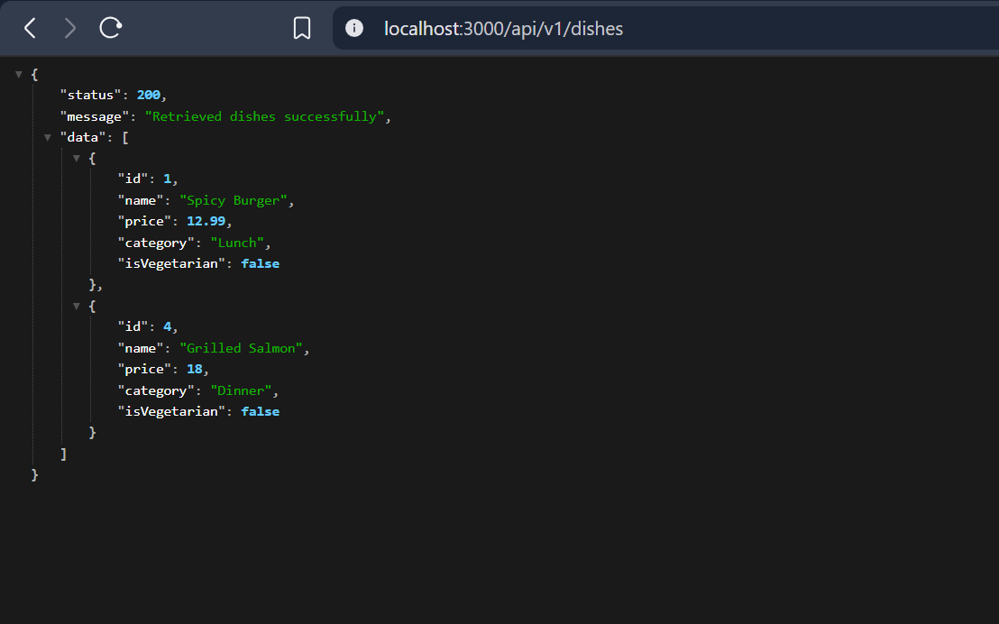

# RESTful API Activity - [Your Name]
## Best Practices Implementation
**1. Environment Variables:**
- Why did we put `BASE_URI` in `.env` instead of hardcoding it?
  
- Answer: 
- We put `BASE_URI` in `.env` to separate configuration from code, making the application more flexible, secure, and easier to deploy across different environments without changing the source code.
  
**2. Resource Modeling:**
- Why did we use plural nouns (e.g., `/dishes`) for our routes?
- Answer:
- We use plural nouns like `/dishes` because it follows the RESTful API conventions. This makes the API more intuitive, predictable and align with standard practices.
**3. Status Codes:**
- When do we use `201 Created` vs `200 OK`?
- Why is it important to return `404` instead of just an empty array or a generic error?
- Answer: 
- 
- `201 Created` is used when resource is successfully created (POST), while `200 OK` is used for successful GET, PUT, or DELETE operations.
  
- It is important t return `404` instead of an empty array or generic error is important because it provides clear, specific information to the client that the requested resource doesn't exist, following HTTP standards and making debugging easier.
**4. Testing:**

- 

o "Why did I choose to Embed the [Review/Tag/Log]?"
- we embed when the data is small, stable, and inseparable from the record (like a tag or log), because there can be only one review for one dishes.

o "Why did I choose to Reference the [Chef/User/Guest]?"
- we reference when the data is large, shared, or frequently updated (like a chef or   user profile), because a dish can have a multiple chefsgit

**Securing API**

**1. Authentication vs Authorization**
Answer:
Authentication is the process of verifying who you are. In our code, this happens in authController.js — when a user registers or logs in with their email and password, and receives a JWT token back.
Authorization is the process of verifying what you are allowed to do. In our code, this is the authorize(...roles) middleware in authMiddleware.js — it checks if the logged-in user's role (e.g. 'admin', 'manager') is allowed to access a specific route.

**2. Security (bcrypt)**
Answer:
We use bcryptjs instead of saving plain text passwords because if the database gets hacked, attackers would see only hashed passwords, not the real ones. In userModel.js, the pre('save') hook hashes the password before storing it, and matchPassword() safely compares the entered password against the hash without ever reversing it.

**3. JWT Structure**
Answer:
When the protect middleware receives a JWT from the client, it:

- Checks if the Authorization header exists and starts with 'Bearer'
- Extracts the token from the header
- Verifies the token using jwt.verify() and the JWT_SECRET
- Decodes the user's id from the token and fetches the user from MongoDB (excluding the password)
- Attaches the user to req.user so the next route/controller can access it
- If anything fails, it returns a 401 Unauthorized error
